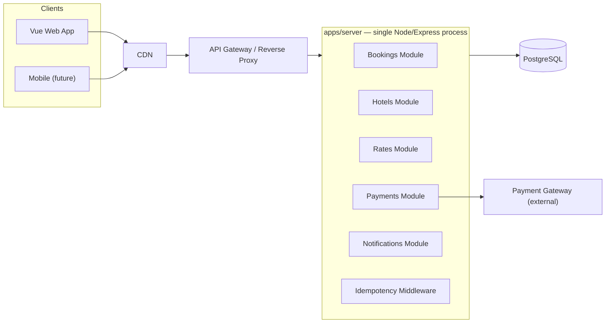
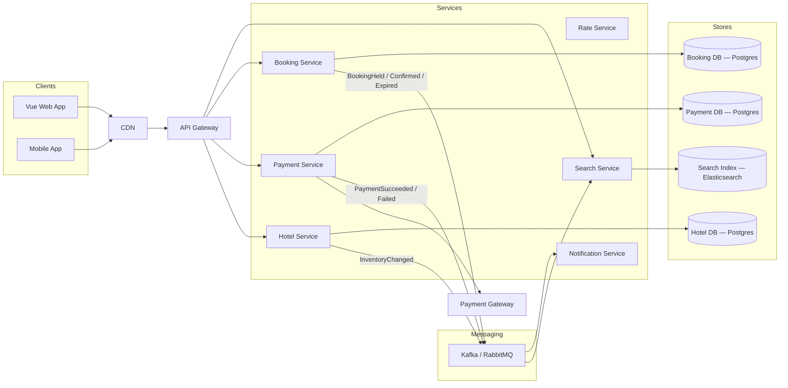
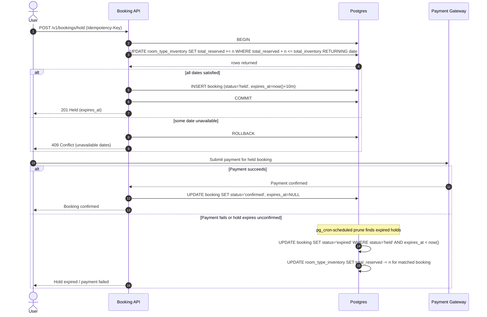

# High-Level Design — Booking Platform

## Status

Phase 1 (modular monolith) is the initial build target. Phase 2 (microservices) is the intended
future evolution. See [ADR-002](../adrs/002-temporary-booking-soft-lock.md) and
[ADR-003](../adrs/003-modular-monolith-then-microservices.md) for the decisions behind this doc.

## Design Requirements

- Pay-at-platform and check-in.
- Mobile-first UI.
- Support for cancellation and overbooking — overbooking is a per-`room_type` percentage
  (`overbooking_rate`), applied as a multiplier against `total_inventory` in the atomic
  reservation check. See `data-models.md`'s Overbooking section.
- Dynamic pricing support: rates vary by date (e.g., a holiday date costs more) — the per-date
  `room_type_rate` table structurally supports this now; no demand-based repricing algorithm is
  required.

## Non-Functional Requirements

| Requirement  | Target                                                                          |
| ------------ | ------------------------------------------------------------------------------- |
| Consistency  | Two users can never book the same room-type/date past capacity — non-negotiable |
| Concurrency  | Thousands of users booking the same hotel simultaneously                        |
| Latency      | Search < 500ms; booking confirmation 2–3s                                       |
| Availability | 99.9%+                                                                          |
| Scalability  | Horizontal scale without redesign                                               |

## Capacity Estimate

~200 QPS read traffic, ~5 TPS write (booking) traffic, based on a 100% view → 10% room-detail →
10% reserve funnel. The architecture is optimized for reads (caching, eventually read replicas)
while keeping the write path — inventory + booking — on a single consistent transaction.

## Phase 1 — Modular Monolith

One deployable, modules organized by domain so a future extraction (Phase 2) is a lift-and-shift
rather than a rewrite. A single Postgres instance is the source of truth — no distributed
transaction is needed, which is what makes the "no double-booking" requirement tractable.

Postgres runs as a plain container in `docker-compose`, alongside the other services (e.g.
Jaeger). Redis is not provisioned initially; introduce it later for read caching if search
latency needs it, not for booking holds — see ADR-002.

## Phase 2 — Target Microservices (future, not scheduled)

Extraction follows the Phase 1 module boundaries. Search sync becomes event-driven
(`InventoryChanged` → bus → Search Service) rather than a direct database link, since a
synchronous cross-database dependency between services would defeat the purpose of splitting them.
This phase is pursued only if/when a specific module outgrows the monolith — see ADR-003.

## Booking Lifecycle (applies to both phases)

Details of the atomic update and pruning statements are in `data-models.md`. This is the piece
that replaces the pessimistic/optimistic locking approaches from the original draft, and it also
answers what happens to inventory on payment failure without needing a saga.

## Open Questions

- Redis: introduce now for read caching, or defer until search latency requires it?
- Notification delivery guarantees (retry/backoff, dead-letter) — deferred; not designed yet, and
  intentionally not blocking Phase 1.
- Whether `pg_cron` is available in the eventual hosting environment — see
  [ADR-002](../adrs/002-temporary-booking-soft-lock.md) for the fallback if not.
- How are failed/retried payment attempts represented? `booking.status` has no state for
  "payment declined, still held" — `transaction` only records settled outcomes.
