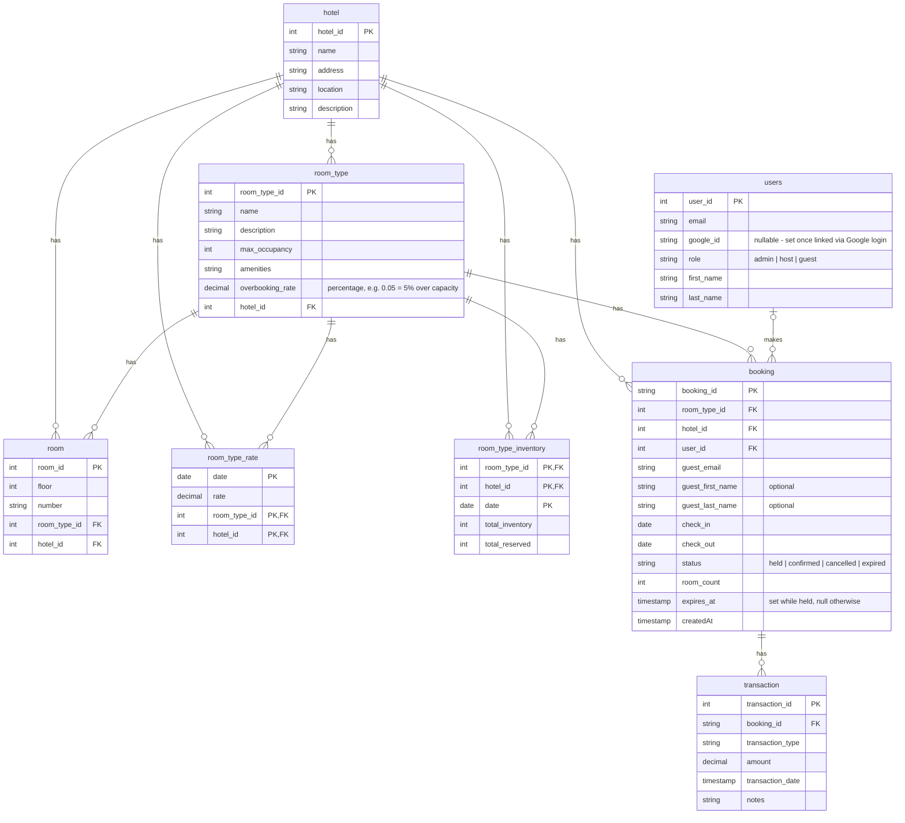

# Data Model

## ERD



## `users`

Guests, hosts, and admins are all authenticated entities in the same system (one login, three
permission levels), so they're modeled as a single `users` table with a `role` column. `host`
additionally implies ownership of one or more `hotel` rows (a `host_id FK` on `hotel`, not shown
above yet — added when `hotel` gets its host-assignment feature).

Every booking requires both a registered user (`booking.user_id`) and a contact email
(`booking.guest_email`) — there is no unauthenticated guest-checkout path. `guest_first_name` /
`guest_last_name` are optional and, when present, override the display name for that booking
(e.g. booking on someone else's behalf) without touching the `users` record itself. Auth is
handled via Google OAuth (`google_id`), not stored passwords.

## Overbooking

Each `room_type` carries an `overbooking_rate` — a percentage stored as a decimal (e.g. `0.05`
= allow bookings up to 5% over `total_inventory`), set per room type rather than per hotel,
since cancellation/no-show rates vary by room category. Default is `0` (no overbooking) unless
explicitly configured. This changes the atomic conditional `UPDATE` in the Inventory
Consistency section below: the capacity check becomes
`total_reserved + n <= total_inventory * (1 + overbooking_rate)` rather than the flat
`<= total_inventory`.

## Booking Lifecycle Fields

- `status`: `held` → `confirmed` → (`cancelled` | `expired`)
- `expires_at`: set when `status = held`, to `now() + <hold window>`; cleared once confirmed,
  cancelled, or expired. Hold window is a tuning parameter — start at 10 minutes and adjust from
  real abandonment data once there is any.

## Inventory Consistency — Atomic Conditional Update

Rather than a separate read → check → write (either `SELECT ... FOR UPDATE` or a `version`
column), reserving inventory is a single conditional `UPDATE` that only succeeds if the row's
current state satisfies the capacity constraint:

```sql
UPDATE room_type_inventory
SET total_reserved = total_reserved + :room_count
WHERE hotel_id = :hotel_id
  AND room_type_id = :room_type_id
  AND date BETWEEN :check_in AND :check_out
  AND total_reserved + :room_count <= total_inventory
RETURNING date;
```

Run this inside a transaction. If the number of rows `RETURNING` is less than the number of dates
in the range, at least one date failed the check — `ROLLBACK` the whole transaction (nothing ends
up partially reserved) and return `409`. If every date succeeded, insert the `held` booking row
in the same transaction and `COMMIT`. Postgres's row-level MVCC makes each row's check-and-increment
atomic on its own, so no explicit lock statement or version-conflict retry loop is required.

## Releasing Expired Holds

Scheduled via `pg_cron` rather than app-side polling — see [ADR-002](../adrs/002-temporary-booking-soft-lock.md#pruning-mechanism):

```sql
UPDATE booking
SET status = 'expired'
WHERE status = 'held' AND expires_at < now()
RETURNING booking_id, hotel_id, room_type_id, check_in, check_out, room_count;

-- for each returned booking, in the same transaction:
UPDATE room_type_inventory
SET total_reserved = total_reserved - :room_count
WHERE hotel_id = :hotel_id AND room_type_id = :room_type_id
  AND date BETWEEN :check_in AND :check_out;
```

Both statements must commit together per booking — if a crash happens between them, inventory
stays stuck as reserved for a hold that no longer exists.

## Example Inventory Data

| hotel_id | room_type_id | date       | total_inventory | total_reserved |
| :------- | :----------- | :--------- | :-------------- | :------------- |
| 211      | 1001         | 2024-12-15 | 100             | 87             |
| 211      | 1001         | 2024-12-16 | 100             | 89             |
| 211      | 1001         | 2024-12-17 | 100             | 92             |
